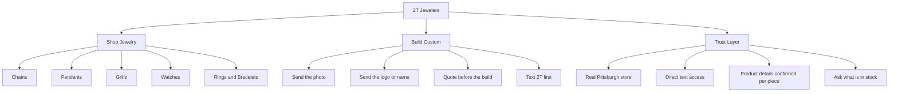
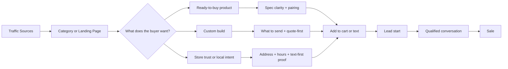

# 2T Jewelers Growth Strategy Report

## Executive Summary

2T Jewelers should not try to beat GLD, TraxNYC, or King Ice on catalog scale, national licensing, or permanent-promo intensity. The higher-probability position is narrower and stronger: **a real Pittsburgh street-luxury jeweler with direct text access, strong custom capability, and tighter claim-safe transparency than the typical hip-hop jewelry ecommerce site**. That position matches the supplied 2T project materials, which repeatedly emphasize “real Pittsburgh store,” “Text 2T,” “shop jewelry + build custom,” and “product details confirmed per piece,” and it is reinforced by public business listings confirming 2T’s physical storefront at 332 Fifth Ave in downtown Pittsburgh. citeturn28view0turn27search1turn27search2

The market logic is favorable. Online jewelry continues to grow faster than total jewelry retail, while industry commentary points to a more selective buyer who still spends when retailers execute clearly on trust, product specificity, and customer experience. At the same time, hip-hop jewelry remains culturally tied to identity, visibility, status, and storytelling, not just adornment. That means 2T’s best commercial opening is **identity-led commerce with low-friction conversation**, especially around chains, pendants, grillz, and higher-ticket watch inquiries. citeturn4search1turn5search2turn17search1turn17search2turn26search1

The most important strategic moves for the next 90 days are clear. First, build **category-led landing pages** that sell specific buying outcomes, not generic luxury language. Second, make **text/WhatsApp the primary conversion action** on high-intent pages, with store-trust proof immediately visible. Third, create **material, stone, fit, and timing clarity modules** that reduce fear without making unverified claims. Fourth, fix the **SEO foundation**: metadata, internal linking, structured data, canonicalization, faceted-navigation controls, Core Web Vitals, and local/NAP consistency. Fifth, run a disciplined **CRO roadmap** focused on driving more text starts, more qualified custom leads, and better category-to-product engagement. citeturn10search0turn10search1turn12search0turn12search1turn13search0turn13search2turn14search1turn10search4turn10search6

The practical implication is this: 2T’s site messaging should feel less like “browse a jewelry store” and more like **“find the piece, understand the spec, text the jeweler, get clarity fast.”** That is the gap between traditional Pittsburgh custom jewelers and high-volume hip-hop ecommerce brands, and it is where 2T can win. Public local search results for Pittsburgh custom jewelry are dominated by traditional bridal/fine-jewelry positioning, not street-luxury or text-first buying journeys, which gives 2T a real local SEO opening if execution is disciplined. citeturn25search1turn25search2turn25search4

## Audience and Purchase Model

Because direct live access to the current 2T storefront was limited, this report uses the supplied 2T project documents and collection-page prototype files as the primary source of truth for brand direction, current messaging, and conversion intent. Those materials consistently frame 2T as a real Pittsburgh street-luxury jeweler with both ready-made categories and a strong custom lane, while public listings confirm the downtown location, phone number, and business presence. Some public directory reviews praise selection and service, while others complain about difficulty reaching the store by phone; strategically, that strengthens the case for a visible, fast, text-first conversion path with clear response expectations. citeturn28view0turn27search1turn27search2turn27search3

Hip-hop jewelry demand is not just trend-driven. The best external evidence in this set points to three recurring demand drivers: jewelry as a marker of success and identity, personalization/storytelling, and visible statement styling rather than quiet minimalism. The American Museum of Natural History’s “Ice Cold” exhibition explicitly frames hip-hop jewelry as culturally significant custom adornment tied to assertion of identity and success, while JCK’s 2026 coverage notes that jewelry “that tells a story” remains a major retail trend and that names, letters, symbols, and pendants continue to index strongly with buyers. citeturn17search1turn17search2turn26search1

### Persona table

| Persona | Demographic snapshot | Psychographics | Purchase triggers | Core objections | Highest-value channels | Assumed 12-month revenue |
|---|---|---|---|---|---|---|
| **Status-First Chain Buyer** | Mostly male, roughly 18–30 | Wants visible shine, neck presence, social status, and “worth posting” look | New drop, birthday, paycheck, event, wanting a chain that “hits” immediately | Unsure on width/length/material, fears looking cheap, wants proof it’s legit | Google commercial search, Instagram, TikTok, direct text | **$250–$650** assumption |
| **Identity Pendant Builder** | Male and female, roughly 19–35 | Wants the piece to represent self, memory, crew, logo, number, or someone important | Photo/logo/name/number idea, gift milestone, memorial/personal statement | Doesn’t know price range, worries final design won’t match vision, needs chain pairing help | Google “custom pendant” search, Instagram/TikTok, text/WhatsApp | **$450–$1,500** assumption |
| **Grillz Trust Buyer** | Mostly male, roughly 20–38 | Wants bold look, but trust hinges on fit, process, comfort, and clarity | Seeing examples, local availability, referral, wanting a top/bottom/full set | Biggest fear is bad fit, unclear process, unclear material/stone details | Local search, Google, referral, direct text | **$600–$2,700** assumption |
| **High-Ticket Watch Inquirer** | Mostly male, roughly 25–45 | Wants scarcity, status, authenticity, and a private, competent buying process | Specific model interest, trade-up intent, certification/status proof, local trust | Availability, authenticity, condition, price transparency, back-and-forth friction | Brand search, referral, Instagram, text/inquiry | **$2,000–$15,000+** assumption |
| **Gift Buyer / Partner** | Often female, roughly 22–40 | Wants a meaningful, giftable, low-risk piece with easy guidance | Birthday, anniversary, holiday, “he’d wear this” idea | Fear of picking wrong size/style/material, wants fast advice rather than catalog overload | Google, Meta/Instagram, gift searches, text | **$150–$600** assumption |

These personas are consistent with the 2T project materials and with external evidence showing ongoing demand for identity-expressive and story-led jewelry, especially pendants, initials, names, and layered personal pieces. The revenue figures above are assumptions only; they should be replaced with actual 2T AOV, repeat purchase, gross margin, and inquiry-close data once GA4, CRM, and sales exports are connected. citeturn17search1turn17search2turn26search1turn4search1

### Messaging implications

For 2T, the right message architecture is not “premium jewelry for everyone.” It is narrower. Buyers need to feel four things quickly: **this is a real store**, **these people know the product**, **I can text them directly**, and **they will tell me what this specific piece actually is before I commit**. That matters even more in this category because many larger competitors rely on heavy promotions, broad claims, or ambiguous material language that can create trust drag even when the merch is visually strong. citeturn8view0turn7view0turn15search6turn6view4

## Competitive Landscape and Positioning

The five most relevant public benchmarks for 2T are GLD, King Ice, TraxNYC, Frost NYC, and Moses NYC. Together they cover the main strategy archetypes in this space: mass-promo catalog, streetwear/licensing, high-ticket custom breadth, category-deep urban jewelry, and inquiry-led prestige. 2T should study all five, but copy none of them directly. citeturn2view1turn2view2turn2view3turn2view4turn2view5

### Competitor comparison

| Brand | Core model | What they do well | What they overuse or risk | Directional organic / traffic proxy | What 2T should take | What 2T should not copy | Evidence |
|---|---|---|---|---|---|---|---|
| **GLD** | Large-scale DTC street jewelry with aggressive offer architecture | Broad category depth; customizable pendants; fine-jewelry segmentation; mobile-heavy traffic base; strong merchandising | Constant BOGO/2-for-$99 promo pressure, lifetime claims, broad guarantees, heavy discount environment | 1.34M visits in Jan 2026; 341.1K organic search traffic; Authority Score 48 | Merchandising depth, pairing logic, category segmentation, mobile UX density | Blanket guarantees, constant discount anchoring, mass-market tone | citeturn23search1turn8view0turn8view1turn8view2turn8view4turn15search6 |
| **King Ice** | Streetwear/jewelry hybrid with collabs and educational content | Strong culture fit; grillz, watches, sale, collections, Jewelry 101; generic category keyword strength | Heavy warranty/sale framing; more brand-led than consultation-led | 194.08K visits in May 2025; strong rankings for “chain,” “cuban link chain,” and “grillz” | Culture fluency, grilled category prominence, education content | Collab-dependent brand posture, claim-heavy top-bar proof | citeturn7view0turn23search0 |
| **TraxNYC** | Massive NYC catalog plus custom and watches | Photo pendants, custom name, chain sets, previous projects, watch depth, strong generic chain demand | Can feel sprawling and overwhelming; higher-ticket custom can outscale smaller brands | 541K–629K monthly visits in accessible snapshots; strong rankings for “gold chain” and “silver chain” | Search-capture breadth, custom-project bridge, category specificity | Over-complex IA, sprawling menu density | citeturn7view3turn6view4turn6view5turn22view2turn24view0 |
| **Frost NYC** | Category-deep urban jewelry with custom pendant lane | Very clear pendant taxonomy: gold, diamond, custom, silver, plated, chain+pendant | Category breadth can blur trust if material distinctions are not immediately obvious | No clean public traffic snapshot retrieved in this run | Clear pendant taxonomy and chain+pendant merchandising | Material ambiguity or broad “diamond” language without context | citeturn7view1turn6view6turn6view7 |
| **Moses NYC** | High-trust, inquiry-led prestige with restrained merchandising | Private watch model, consultation-led custom, clean hierarchy, calm authority | Too restrained and luxury-editorial for 2T’s audience if copied directly | No clean public traffic snapshot retrieved in this run | Strong inquiry architecture, high-ticket trust posture | Boutique restraint, softer luxury tone, low product energy | citeturn7view2 |

### Positioning recommendation

2T should position itself between TraxNYC and Moses NYC on trust, and between King Ice and Frost NYC on energy. In practice, that means **more product-specific than Moses, less promo-saturated than GLD, more trust-forward than King Ice, and more text-first than TraxNYC**. The differentiator is not “luxury.” It is **street-luxury clarity**: a real city store, direct access, better conversation, and fewer fake-feeling claims. Public listings already give 2T something many pure-play competitors do not have: a real downtown address and local footprint. The site should turn that into commercial advantage. citeturn28view0turn27search1turn17search1

### Site messaging hierarchy

The message on every high-intent page should follow the same order: **what the piece is, what you can customize, what is verified, and how to start by text.** That is the right hierarchy for buyers who are excited by identity and status but still skeptical of ecommerce jewelry claims. citeturn17search2turn26search1turn27search2turn27search3

## SEO Strategy

The most practical SEO opportunity for 2T is not trying to outrank giant brands head-on for every broad phrase. It is building a layered capture strategy around **high-intent commercial category pages**, **local Pittsburgh modifiers**, and **informational trust content** that answers the exact friction points buyers have before texting or buying. That matters because Google Keyword Planner is useful for discovering ideas and estimates, but its competition metric is for ads, not for organic difficulty; Ahrefs also explicitly distinguishes Keyword Planner competition from organic ranking difficulty. Since direct access to 2T’s paid GKP / Ahrefs / Semrush account exports was not available here, the map below is **intent-led and execution-ready**, but it should be volume-validated before media forecasting or content ROI modeling. citeturn11search0turn11search1turn9search0turn9search2

### Keyword map

| Intent | Keyword cluster | Suggested target page | Priority | Notes |
|---|---|---|---|---|
| Commercial | hip hop jewelry | Homepage / main category hub | High | Brand-defining discovery term |
| Commercial | men’s hip hop jewelry | Men’s hub or collection hub | High | Good for category framing |
| Commercial | iced out jewelry | Category hub | High | Strong styling intent |
| Commercial | street-luxury jewelry | About + category copy | Medium | Lower volume, stronger fit |
| Transactional | custom pendant | `/collections/pendants` + `/custom-pendants` | High | Core money term |
| Transactional | custom logo pendant | `/custom-logo-pendant` landing page | High | Strong custom-intent page |
| Transactional | custom photo pendant | `/custom-photo-pendant` landing page | High | Strong identity / memorial / gift intent |
| Transactional | name pendant | `/name-pendants` landing page | High | Broad accessible entry |
| Transactional | number pendant | `/number-pendants` landing page | Medium | Sports / identity / memorial |
| Transactional | iced out pendant | `/iced-out-pendants` | High | Product-aware intent |
| Transactional | photo pendant with chain | `/photo-pendant-necklace` or bundle page | High | Pairing + AOV opportunity |
| Transactional | chain and pendant set | `/chain-pendant-sets` | High | Cross-sell page |
| Transactional | cuban chain | `/collections/chains/cuban` | High | Generic chain demand is clearly active in this market |
| Transactional | rope chain | `/collections/chains/rope` | High | Core style term |
| Transactional | tennis chain | `/collections/chains/tennis` | High | Core style term |
| Transactional | grillz pittsburgh | `/grillz-pittsburgh` | High | Strong local-intent opportunity |
| Transactional | custom jewelry pittsburgh | `/custom-jewelry-pittsburgh` | High | Local lead capture |
| Transactional | custom pendant pittsburgh | `/custom-pendant-pittsburgh` | High | Local + category overlap |
| Transactional | jewelry store pittsburgh downtown | Local landing page / contact / about | Medium | Store-trust and map intent |
| Informational | how much does a custom pendant cost | Blog / FAQ / quote explainer | High | Strong bottom-funnel content |
| Informational | solid gold vs gold plated jewelry | Blog / material explainer | High | Trust content |
| Informational | moissanite vs cz pendant | Blog / material explainer | Medium | Valuable if applicable per inventory |
| Informational | pendant size guide | Blog / PDP support | High | Reduces hesitation |
| Informational | chain length guide for men | Blog / PDP support | High | Pairing and fit help |
| Informational | how to choose a chain for a pendant | Blog / PDP support | High | Direct AOV driver |
| Informational | how photo pendants work | Blog / custom explainer | Medium | Good for custom conversion |
| Informational | how grillz fitting works | Grillz authority page / FAQ | High | Trust-critical |
| Informational | what to ask before buying jewelry online | Blog / trust content | Medium | Good trust asset |

This map is supported by competitor IA and publicly visible keyword snapshots. King Ice ranks on generic terms like “chain,” “cuban link chain,” and “grillz,” TraxNYC captures “gold chain” and “silver chain,” and Icebox captures “tennis chain” and “diamond earrings for men,” which confirms that broad style terms still matter. Meanwhile, local Pittsburgh results for custom jewelry skew traditional and bridal, leaving an opening for street-luxury-specific local landing pages. citeturn23search0turn24view0turn24view1turn25search1turn25search2turn25search4

### On-page SEO recommendations

Every category page should be rebuilt around **buying-intent information density**. That means a keyword-aligned title tag, single clear H1, a short intro that names the styles buyers search for, a spec block that answers fit/material/stone questions, a pairing or “how to choose” section, FAQs, and internal links to adjacent categories and custom pages. For pendants, that means not just “Pendants,” but copy that naturally covers custom pendant, photo pendant, logo pendant, name pendant, iced-out pendant, and pendant + chain pairings. Google’s product and merchant-listing documentation also makes clear that product pages benefit from structured `Product` / `Offer` markup, while review markup should only be used when the underlying reviews genuinely exist and follow Google’s guidelines. citeturn10search1turn10search2turn10search3

For category architecture, the most important rule is separation by **real buyer language**. 2T should create dedicated indexable pages for core styles buyers actually search, not just throw everything into one collection. Minimum viable set: custom pendants, photo pendants, logo pendants, name pendants, iced-out pendants, Cuban chains, rope chains, tennis chains, grillz, watches, and Pittsburgh-local custom pages. Internal links should connect these pages in a deliberate ladder: broad category → style category → PDP or inquiry page → related explainer article. Google’s documentation on canonicalization and crawling makes this especially important when filtered or variant URLs multiply. citeturn12search0turn12search1turn13search2

### Technical SEO issues to check before launch

The supplied prototype files indicate a modern Next.js build path, which is good for performance and templating, but the launch checklist should be strict.

| Check area | Why it matters | What to check |
|---|---|---|
| Metadata | Search appearance and CTR | Unique title/descriptions for every category, PDP, and city page |
| Canonicals | Duplicate control | Ensure one canonical URL per category/PDP; prevent tracking or filter variants from competing |
| Structured data | Rich results eligibility | `Product`, `Offer`, `ProductGroup` where variants exist; only use review markup when verified |
| Sitemap and robots | Discovery and crawl control | XML sitemap for canonical pages only; block staging / duplicate environments |
| Faceted navigation | Crawl budget and duplicate risk | Keep filters from exploding URL count; use consistent params; return useful responses for empty combinations |
| Core Web Vitals | UX and rankings | LCP, INP, CLS targets; compress media; prioritize mobile |
| Image SEO | Conversion + image search | Descriptive filenames, alt text, width/height, compression |
| Merchant data | Shopping visibility | Merchant Center / product feed readiness and complete offer data |
| Local SEO / NAP | Trust + map consistency | Align address, hours, phone, and website across listings; the public Cylex listing still points to `2tjewelers.placeweb.site`, so the website URL should be updated when the new build is live |
| Staging control | Launch hygiene | Ensure prototype/staging environments are `noindex` until approved |

Google explicitly recommends canonical signals, product structured data, and careful faceted-navigation controls because duplicate variants and filter combinations can waste crawl resources and dilute signals. Google and web.dev also continue to emphasize Core Web Vitals thresholds around LCP, INP, and CLS. The public 2T listing data also suggests a local-consistency task is needed once the live domain is finalized. citeturn12search0turn12search1turn13search0turn13search2turn10search0turn10search1turn14search1turn28view0

### Content topics and three-month calendar

| Publish week | Topic | Primary target | Funnel role | CTA |
|---|---|---|---|---|
| Month one | How much does a custom pendant cost | how much does a custom pendant cost | BOFU | Text 2T for a quote |
| Month one | How to choose the right chain for your pendant | how to choose a chain for a pendant | BOFU | Ask about pairings |
| Month one | Pendant size guide | pendant size guide | BOFU | Text for size advice |
| Month one | Photo pendants vs logo pendants | custom photo pendant / custom logo pendant | MOFU | Send the photo or logo |
| Month two | Gold plated vs solid gold | solid gold vs gold plated jewelry | BOFU | Ask what this piece is made of |
| Month two | What buyers should know before ordering grillz | how grillz fitting works | BOFU | Start with the fit |
| Month two | Best chain lengths for men | chain length guide for men | MOFU | Ask which length hits best |
| Month two | Name pendants, number pendants, and logo pendants | name pendant / number pendant | MOFU | Build your piece |
| Month three | Custom jewelry in Pittsburgh | custom jewelry pittsburgh | BOFU + local | Visit or text 2T |
| Month three | Where to buy grillz in Pittsburgh | grillz pittsburgh | BOFU + local | Text 2T about grillz |
| Month three | What to ask before buying jewelry online | what to ask before buying jewelry online | TOFU/MOFU | Ask before you buy |
| Month three | How to buy a pendant as a gift | pendant gift guide | MOFU | Text us for gift help |

This calendar is intentionally close to revenue. It prioritizes commercial-support content over soft lifestyle blogging. That matches both the selective buyer environment described by industry sources and the continuing demand for story-led, identity-led jewelry. It also maps well to the way competitors educate or segment buyers through style hubs, blog/education sections, and custom explainers. citeturn5search2turn26search1turn7view0turn6view4

## CRO, Messaging, and Paid Creative

2T’s conversion system should revolve around one core principle: **reduce imagination gap and trust friction faster than competitors**. In this category, most lost conversions happen because buyers do not know what the piece will really look like, whether the materials/stones are what they think, how the chain/piece pairing works, or whether a real person will answer. Public reviews for 2T also suggest that response confidence matters. The site should therefore convert by proving competence quickly, not by sounding more luxurious. citeturn27search2turn27search3turn15search6turn17search2

### Product page messaging templates

| Page element | Ready-to-buy template | Custom / inquiry template |
|---|---|---|
| Headline | **[Style] [Category] Built to Get Noticed** | **Build a [Logo / Photo / Name / Number] Pendant That Means Something** |
| Subheadline | **Choose the look. Confirm the details. Text 2T if you want help before you buy.** | **Send the photo, logo, name, or number. We review the idea and quote before the build.** |
| Benefits block | **Style that hits in person; pairing help available; product details confirmed per piece** | **Direct text access; quote before the build; no deposit to start if that policy is active and verified** |
| Material / spec block | **Metal / finish / stone / width / length / weight / fit notes** | **Design type / size range / finish direction / chain pairing / what to send** |
| Social proof / trust | **Real Pittsburgh Store. Direct Text Access. Product Details Confirmed Per Piece.** | **Real Pittsburgh Store. Text 2T before anything starts. Product details confirmed per piece.** |
| Urgency | **Ask what’s in stock now. Availability may vary.** | **Ask what’s running now. Timing and production details are confirmed before purchase.** |
| CTA | **TEXT 2T ABOUT THIS PIECE** / **ASK ABOUT PAIRING** | **SEND THE PHOTO** / **TEXT 2T TO START** |

The key is not “hype copy.” It is **specificity plus momentum**. GLD, TraxNYC, Frost NYC, and King Ice all show some version of category clarity, offer framing, chain/pendant logic, or custom intake. 2T should borrow the structural clarity and drop the blanket claims. citeturn8view1turn6view4turn7view1turn7view0

### Suggested visual assets and mockup ideas

| Asset | Purpose | Placement |
|---|---|---|
| Macro close-up video of chain movement and stone flash | Immediate perceived quality | Hero, PDP gallery, paid social |
| Hand-held mirror selfie / neck-on-body shots | Shows scale and “hits in person” energy | Category cards, PDP, ads |
| Pendant front + back + bail close-ups | Reduces ambiguity on construction | PDP gallery |
| Chain + pendant pairing carousel | Increases AOV and styling clarity | PDP and category pages |
| “What to send” visual tile set | Makes custom easy to start | Custom and pendant pages |
| Downtown Pittsburgh store exterior/interior shots | Converts local trust into commercial proof | Trust strip, About, local SEO pages |
| Short text-message UI mockup | Reinforces frictionless direct access | CTA modules and ads |
| Grillz process visuals | Removes fit anxiety | Grillz landing page and FAQ |

### Search, shopping, and social ad copy

#### Search ad variants

**Headlines**
- Custom Pendants in Pittsburgh
- Text 2T About Your Pendant
- Send Your Logo or Photo
- Cuban, Rope, Tennis Chains
- Grillz Start With the Fit
- Real Pittsburgh Jewelry Store
- Ask What’s In Stock Now
- Quote Before the Build

**Descriptions**
- Real Pittsburgh store. Send the photo, logo, name, or number and get next-step guidance before the build.
- Need a chain, pendant, grillz, or watch? Text 2T directly. Product details are confirmed per piece.
- Shop the shine or build custom. Ask about availability, material direction, and current offers.
- Chain plus pendant help available. Start with the look you want and get fast direction by text.

#### Shopping title formulas

- **[Style] [Category] | [Color / Finish] | 2T Jewelers**
- **Custom [Logo / Photo / Name] Pendant | 2T Jewelers Pittsburgh**
- **[Width]mm [Style] Chain | [Finish] | 2T Jewelers**

#### Social ad hooks

| Hook | Body | CTA |
|---|---|---|
| **Send the logo. Wear the piece.** | Start with a photo, logo, name, or number. We’ll tell you what can be made before anything starts. | Text 2T |
| **Need a chain that actually hits?** | Cuban, rope, tennis, and more. Ask what’s in stock and what pairs best with your pendant. | Ask about chains |
| **Custom starts with the idea, not the guesswork.** | Send the reference. Get direction before the build. | Start custom |
| **Real Pittsburgh store. Real direct access.** | Come through the store or text first. Product details are confirmed per piece. | Text 2T now |

### CRO experiment roadmap

| Priority | Test | Hypothesis | Variant A | Variant B | Primary metric | Guardrail metrics |
|---|---|---|---|---|---|---|
| Highest | Hero CTA framing | “Text 2T” will outperform generic shop/custom CTAs on high-intent pages | BUILD CUSTOM | TEXT 2T ABOUT PENDANTS | CTA click-through to text / WhatsApp | Bounce rate, scroll depth |
| Highest | Trust strip placement | Early store-trust proof will increase text starts | Trust near footer only | Trust directly under hero | Text starts / lead rate | Time on page |
| Highest | Material clarity module | Specific spec disclosure reduces hesitation | Minimal copy | Expandable spec + “ask before you buy” | CTR to next step / add-to-cart / lead rate | Exit rate |
| Highest | Chain pairing module | Showing pairings increases AOV and next-step action | No pairing module | “Pair this with…” module | Pairing clicks / product depth / AOV | Bounce rate |
| High | Custom intake starter | Visual “what to send” examples increase custom-start rate | Generic custom CTA | 4-tile “photo / logo / name / number” chooser | Custom form starts / text starts | Drop-off after click |
| High | Local proof block | Pittsburgh proof increases local + skeptical-buyer trust | No local proof | Address / store / hours / visit-text block | Local CTA clicks / lead rate | Bounce rate |
| High | Offer module language | Verified-safe promo copy beats vague “specials” wording | “Special of the week” generic | “Ask what’s running now” + eligible-items language | CTA CTR | Trust proxy, exit rate |
| High | Sticky mobile CTA | Persistent text CTA lifts mobile conversions | No sticky CTA | Sticky “Text 2T” bar | Mobile lead rate | CLS / INP |
| Medium | FAQ depth | Objection-answering FAQ reduces abandonment | Minimal FAQ | FAQ for material, timing, fit, availability | Scroll-to-FAQ usage / lead rate | Time on page |
| Medium | User-generated proof when verified | Real store/customer proof increases confidence | No proof | Verified customer photo/video or review block | CTA CTR / conversion rate | Page speed |

### CRO experiment flow

The most important CRO metric for 2T is not a generic ecommerce conversion rate by itself. It is **qualified conversation rate**, because the business model includes text-first assisted selling, custom quoting, and higher-trust categories like grillz and watches. GA4 and CRM should therefore be configured to measure both ecommerce activity and lead-funnel progression. citeturn10search4turn10search5turn10search10

## Measurement, Timeline, and Limitations

### Analytics and KPI tracking plan

Google’s GA4 ecommerce documentation is explicit: ecommerce events like `view_item`, `add_to_cart`, `begin_checkout`, and `purchase` are not automatically collected in all contexts and need proper implementation, while lead-generation funnels can be measured through recommended lead events. For 2T, that means tracking two parallel systems: **commerce events** for standard shopping behavior and **lead events** for text/custom/watch/grillz inquiry behavior. citeturn10search4turn10search5turn10search6turn10search10

| KPI | GA4 / tracking event | Why it matters |
|---|---|---|
| Category page engagement | `view_item_list`, scroll depth, CTA clicks | Measures page-market fit |
| Product interest | `select_item`, `view_item` | Tracks merch engagement |
| Text / WhatsApp starts | custom event: `click_text_2t` / `open_whatsapp` | Core assisted-conversion KPI |
| Custom flow starts | `generate_lead`, `form_start`, `upload_reference` | Measures custom demand |
| Qualified lead rate | CRM stage map + GA4 lead events | Separates curiosity from revenue potential |
| Add-to-cart rate | `add_to_cart` | Standard ecommerce signal |
| Checkout progression | `begin_checkout`, `add_shipping_info`, `add_payment_info` | Funnel diagnosis |
| Purchase revenue | `purchase` | Core revenue metric |
| Promo interaction | `view_promotion`, `select_promotion` | Measures promo effectiveness |
| Close rate by intent | CRM + offline conversion import | Critical for text-first model |
| Store-visit intent | map click, address click, call click | Local/offline assist signal |
| Reply SLA | CRM / messaging platform metric | Directly impacts trust and close rate |

### Implementation timeline and resource estimates

| Time block | Major deliverables | Core roles | Estimated hours |
|---|---|---|---|
| Weeks one and two | Messaging framework, page hierarchy, metadata plan, analytics spec, local SEO cleanup brief | Messaging director, SEO strategist, analytics lead | 35–50 |
| Weeks three and four | Pendants, chains, grillz, watches, and local landing-page rewrites; trust modules; FAQ framework | Copy strategist, designer, SEO strategist | 45–65 |
| Weeks five and six | Structured data, canonical / sitemap / robots setup, image standards, merchant feed prep, GA4 and event deployment | Developer, technical SEO, analytics lead | 35–55 |
| Weeks seven and eight | First CRO wave: hero CTAs, trust strip, pairing modules, sticky mobile CTA, custom intake improvements | CRO strategist, designer, developer | 40–60 |
| Weeks nine through twelve | Blog sprint, ad creative launch, experiment readouts, lead-quality reporting loop | Copy strategist, paid media lead, CRO strategist, analyst | 45–70 |

| Role | Recommended scope | Estimated total hours |
|---|---|---|
| Voice-of-customer copy strategist | Core page rewrites, FAQs, ads, trust copy | 30–45 |
| SEO strategist | Keyword map, metadata, architecture, internal links, local plan | 25–40 |
| Technical SEO / developer | Metadata, schema, canonicals, sitemap, performance, tracking | 25–45 |
| CRO strategist | Experiment design, prioritization, readouts | 20–30 |
| Designer / art director | Trust modules, visuals, pairing cards, ad mockups | 20–35 |
| Analytics lead | GA4, CRM mapping, dashboard, offline conversion loop | 15–25 |

A realistic first-wave resource estimate is **135 to 220 total hours** for a clean 90-day rollout, assuming no major replatforming surprises and no large product-data cleanup exercise. That is enough to launch the core strategy, but not enough to fabricate full social proof, high-volume product photography, or a large-scale editorial program. Those should be phased separately.

### Open questions and limitations

This report is intentionally rigorous, but several inputs were missing and should be resolved before final forecasting.

The biggest limitations are first-party data access. I did **not** have direct access to 2T’s live GA4, Search Console, Merchant Center, Google Ads, Meta Ads, CRM, or paid Keyword Planner / Ahrefs / Semrush exports, so I have not included exact keyword volumes, CAC estimates, or conversion baselines. Google Keyword Planner requires billing-enabled account access for core keyword-discovery features, and third-party traffic figures shown here are directional benchmarking proxies, not 2T actual performance. citeturn11search0turn23search1turn24view0turn24view1

There are also verification gaps on product and policy claims. Materials, stone types, stock status, production times, returns, shipping promises, financing specifics, and warranties all need product-level or policy-level verification before being used in live copy or ads. That is especially important because several major competitors publish aggressive lifetime, shipping, and promo claims, and because Google’s product rich-result documentation expects structured offer data to match what is actually present on page. citeturn8view0turn7view0turn10search1turn10search2

Finally, local and website consistency should be cleaned up at launch. Public directory data still points at `2tjewelers.placeweb.site`, while the supplied project materials indicate a separate Next.js prototype is the active build path. When the approved live site is ready, every key listing should be updated to the final canonical domain, with consistent address, hours, and contact paths. citeturn28view0